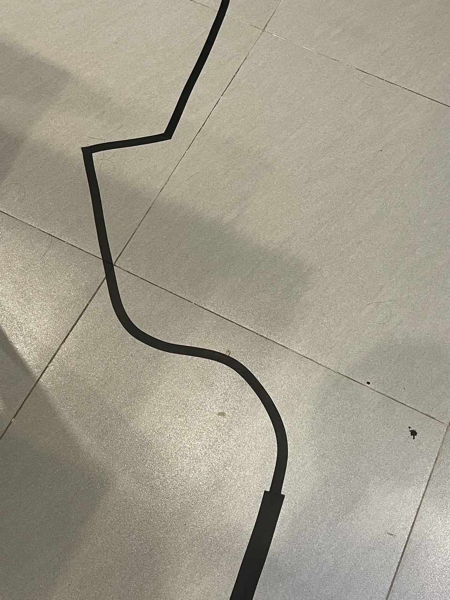
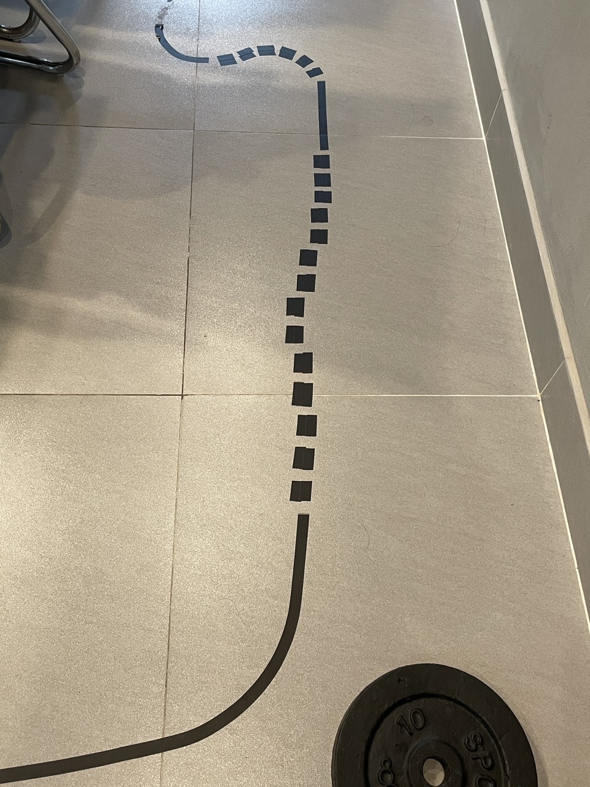
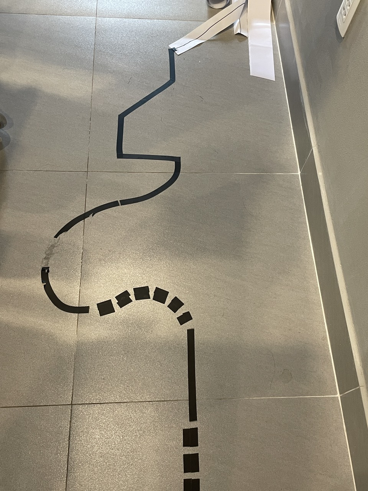
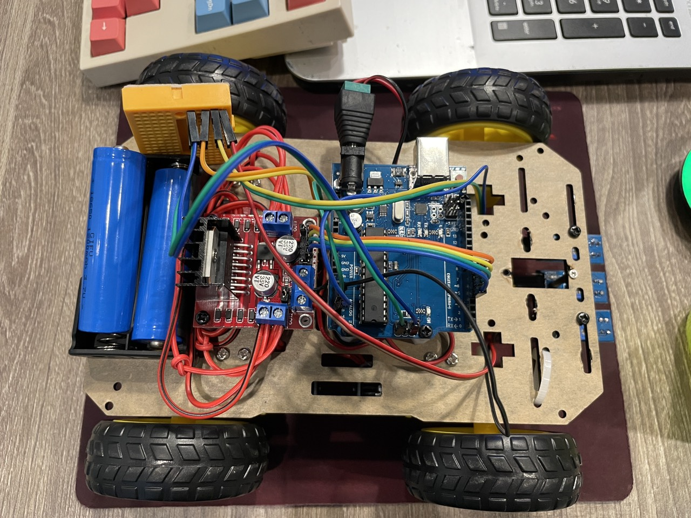
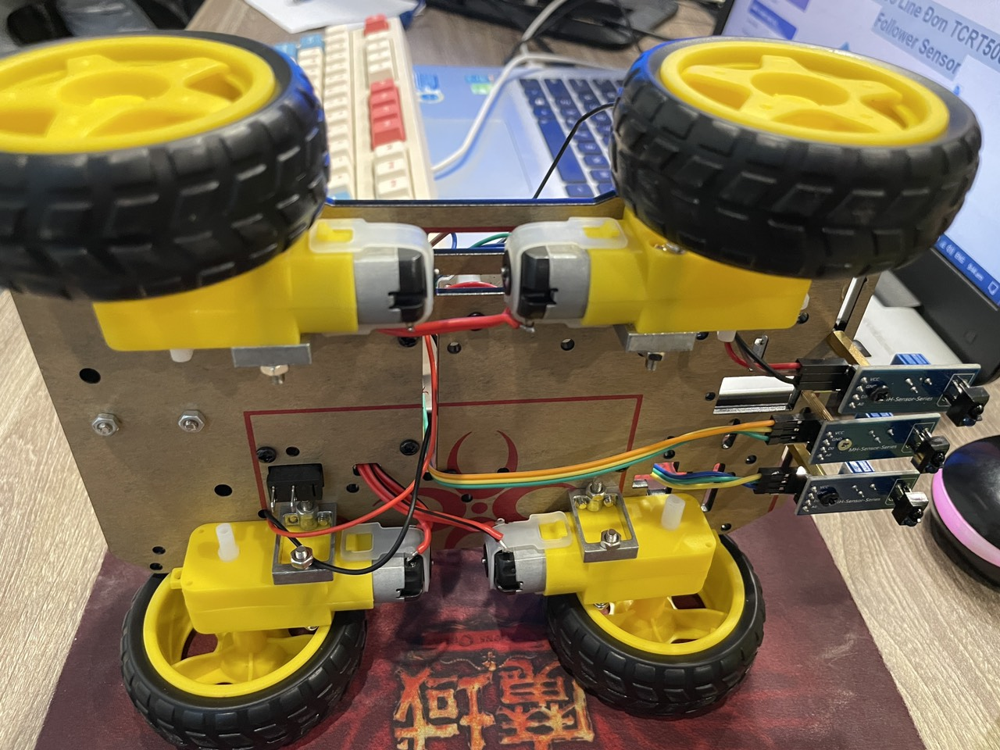
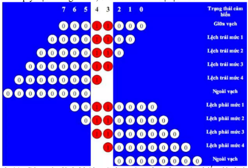
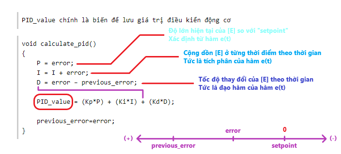

# Xe dò line

Các loại đường line:

> - Thẳng.
> - Thẳng đứt khúc.
> - Cong tròn.
> - Cong tròn đứt khúc.
> - Góc vuông (90º).
> - Góc hơi bẹt (135º).
> - Góc nhọn (45º).
>
> |Line_1|Line_2|Line_3|
> |------|------|------|
> ||||
>
> Sử dụng băng keo đen làm đường line, có độ dày khoảng `1,6cm`!

## Version 1 - CarLine

Phần cứng sử dụng:

> **Bộ linh kiện China (giá rẻ):**
> - ~~[Thanh 5 Cảm Biến Dò Line TCRT5000 Line Follower Sensor](https://hshop.vn/products/thanh-5-cam-bien-do-line-tcrt5000-line-follower-sensor).~~
> - [Cảm Biến Dò Line Đơn TCRT5000 Line Follower Sensor](https://hshop.vn/products/cam-bien-do-line-don).
> - [Mạch Điều Khiển Động Cơ L298 DC Motor Driver](https://hshop.vn/products/mach-dieu-khien-dong-co-dc-l298).
> - [Mạch Uno (Arduino Uno Compatible)](https://hshop.vn/products/arduino-uno-r3).
>
> **Mặt trước:**
>
> 
>
> **Mặt sau:**
>
> 

Thuật toán sử dụng:

> Thanh dò line có 5 mắt, được tổ chức theo cấu trúc sau. Trong đó:
> - `bit 1` nghĩa là mắt cảm biến ngay <u>trên</u> đường line.
> - `bit 0` nghĩa là mắt cảm biến <u>ngoài</u> đường line.
>
> Dựa trên cách phân giá trị phản hồi của từng mắt, mình có được các trường hợp, như hình ví dụ sau.
>
> 
>
> **BẢNG TRẠNG THÁI CẢM BIẾN:**
>
> Với 5 mắt cảm biến dò line, ta có thể có tất cả **25 = 32 trường hợp** nhận được.
>
> Tuy nhiên chỉ có `9 trường hợp` để <u>sử dụng</u> + `3 trường hợp` <u>đặc biệt</u>, cho quá trình xử lý khi xe di chuyển trên đường line.
>
> Các mức lệch ngoài line gồm `+5` và `-5`, sẽ cần một <u>biến nhớ trạng thái</u> theo dõi liên tục *"hướng lệch"*, để biết lần cuối xe đang bị lệch sang trái hay sang phải.
>
> |-|Led5|Led4|Led3|Led2|Led1|DEC|Level|
> |-|:--:|:--:|:--:|:--:|:--:|:-:|:---:|
> |Vị trí|Bên TRÁI Line||Chính GIỮA Line||Bên PHẢI Line|
> |Thứ tự mảng|`[4]`|`[3]`|`[2]`|`[1]`|`[0]`|
> |Góc **45º** (bên trái)|`1`|0|`1`|0|0|**20**|`!`
> |Góc **90º** (bên trái)|`1`|`1`|`1`|0|0|**28**|`!`
> |Ngoài line (lệch phải)|0|0|0|0|0|**0**|`+5`
> |Lệch phải (mức `4`)|`1`|0|0|0|0|**16**|`+4`
> |Lệch phải (mức `3`)|`1`|`1`|0|0|0|**24**|`+3`
> |Lệch phải (mức `2`)|0|`1`|0|0|0|**8**|`+2`
> |Lệch phải (mức `1`)|0|`1`|`1`|0|0|**12**|`+1`
> |**Giữa line**|0|0|`1`|0|0|**4**|`0`
> |Lệch trái (mức `1`)|0|0|`1`|`1`|0|**6**|`-1`
> |Lệch trái (mức `2`)|0|0|0|`1`|0|**2**|`-2`
> |Lệch trái (mức `3`)|0|0|0|`1`|`1`|**3**|`-3`
> |Lệch trái (mức `4`)|0|0|0|0|`1`|**1**|`-4`
> |Ngoài line (lệch trái)|0|0|0|0|0|**0**|`-5`
> |Góc **90º** (bên phải)|0|0|`1`|`1`|`1`|**7**|`!`
> |Góc **45º** (bên phải)|0|0|`1`|0|`1`|**5**|`!`
>
> **Điểm mạnh** của xe có <u>5 mắt line</u> là xử lý tốt các *"đường line vuông góc"*.
>
> **THỰC TẾ:**
>
> Sau khi test với các thanh dò line làm sẵn, mình thấy thực sự ko ổn chút nào, chất lượng quá tệ. Mình phải bỏ luôn chúng. Và chuyển qua *"Dò Line Đơn"*, nên tinh gọn lại còn 3 mắt thôi.
>
> Test với [3Line no PID](https://www.youtube.com/shorts/PEhXUHPLFs4).
>
> Test với [3line PID](https://www.youtube.com/shorts/-XWY5h36vE4).
> <pre>
> Cộng/Trừ bù so với gốc "SPEED_DEFAULT"
> Tốc độ mặc định 30%
> Ngưỡng giới hạn +/- 50%
> KP = 25.0
> KI = 0.00001
> KD = 11.0
> </pre>
>
> |-|Led3|Led2|Led1|DEC|Level|
> |-|:--:|:--:|:--:|:-:|:---:|
> |Vị trí|Bên TRÁI Line|Chính GIỮA Line|Bên PHẢI Line|
> |Thứ tự mảng|`[2]`|`[1]`|`[0]`|
> |Ngoài line (lệch phải)|0|0|0|**0**|`+3`
> |Lệch phải (mức `2`)|`1`|0|0|**4**|`+2`
> |Lệch phải (mức `1`)|`1`|`1`|0|**6**|`+1`
> |**Giữa line**|0|`1`|0|**2**|`0`
> |Lệch trái (mức `1`)|0|`1`|`1`|**3**|`-1`
> |Lệch trái (mức `2`)|0|0|`1`|**1**|`-2`
> |Ngoài line (lệch trái)|0|0|0|**0**|`-3`
>
> **Điểm yếu** của xe chỉ có <u>3 mắt line</u> là ko xử lý tốt các *"đường line vuông góc"*. Lúc này cảm biến hiểu đang lệch mức `+1` hoặc `-1`. Trong khi, đáng lẽ lúc này xe phải xoay trái/phải gấp để bám kịp theo line.

## Version 2 - CarUltra

Phần cứng sử dụng:

> **Bộ linh kiện China (giá rẻ):**
> - [Động Cơ RC Servo 9G](https://hshop.vn/products/dong-co-rc-servo-9g).
> - [Cảm Biến Siêu Âm UltraSonic HY-SRF05](https://hshop.vn/products/cam-bien-sieu-am-srf05).
> - [Mạch Điều Khiển Động Cơ L298 DC Motor Driver](https://hshop.vn/products/mach-dieu-khien-dong-co-dc-l298).
> - [Mạch Uno (Arduino Uno Compatible)](https://hshop.vn/products/arduino-uno-r3).

## Version 3 - CarBLE

Phần cứng sử dụng:

> **Bộ linh kiện China (giá rẻ):**
> - [Mạch Thu Phát Bluetooth 3.0 SPP / BLE 4.2 Dual Mode JDY-33 (HC-05 / HC-06 Compatible)](https://hshop.vn/products/mach-thu-phat-bluetooth-dual-mode-3-0-spp-ble-4-2-jdy-33-hc-05-hc-06-compatible).
> - [Mạch Điều Khiển Động Cơ L298 DC Motor Driver](https://hshop.vn/products/mach-dieu-khien-dong-co-dc-l298).
> - [Mạch Uno (Arduino Uno Compatible)](https://hshop.vn/products/arduino-uno-r3).

## Nguồn tài liệu

Về PID:

> - Bài nghiên cứu giải thích rất dễ hiểu về PID - [Robot bám đường ứng dụng thuật toán PID - Line follow robot with PID . Chu Quang Thảo](https://www.slideshare.net/thaomappro/robot-bm-ng-line-follow-robot-q-thao).
> - Phần code thuật toán PID dễ hiểu (nhưng thiếu!) - [Bộ điều khiển PID - ứng dụng phần 2 - xe dò line dùng thuật toán PID](http://arduino.vn/bai-viet/1133-bo-dieu-khien-pid-ung-dung-phan-2-xe-do-line-dung-thuat-toan-pid).
> - Video giải thích PID - [Controlling Self Driving Cars](https://www.youtube.com/watch?v=4Y7zG48uHRo&ab_channel=AerospaceControlsLab).
> - Video minh họa cách chỉnh thông số PID - [Hardware Demo of a Digital PID Controller](https://www.youtube.com/watch?v=fusr9eTceEo&ab_channel=GregoryL.Holst).
> - |
> - [I made a SUPER FAST Line Follower Robot Using PID!](https://www.youtube.com/watch?v=QoNkpnpvEqc&ab_channel=ShyamRavi).
> - [How To Make A DIY Arduino Line Follower Car At Home](https://www.youtube.com/watch?v=t7k9D1jDEtk&ab_channel=DIYBuilder).
> - [How to code your Line follower robot with PID control and working code!](https://www.youtube.com/watch?v=8Lj5ycrT9Fw&ab_channel=robojunkies).
> - |
> - Union - [C - Unions](https://www.tutorialspoint.com/cprogramming/c_unions.htm).
> - Bit Fields - [C - Bit Fields](https://www.tutorialspoint.com/cprogramming/c_bit_fields.htm).
> - Structures - [C - Structures](https://www.tutorialspoint.com/cprogramming/c_structures.htm).
> - |
> - Một cách sử dụng kết hợp Union và Bit-Files - [Unions And Bit-Fields](https://icarus.cs.weber.edu/~dab/cs1410/textbook/5.Structures/unions.html).

Về Servo:

> - Thư viện Servo cho Arduino - [Servo](https://www.arduino.cc/reference/en/libraries/servo/). → Trên các bo mạch không phải Mega, việc sử dụng thư viện sẽ vô hiệu hóa chức năng `analogWrite()` **(PWM)** trên các chân `9` và `10`, cho dù có Servo trên các chân đó hay không. → Nên mình chỉ sử dụng chân `D9` và `D10` cho tính năng Digital.

## Thuật toán PID

Có tất cả 3 khâu, thường được đề cập theo thứ tự:
>
> 1. `P` - (Propotional) - đây là khâu tỉ lệ.
> 2. `D` - (Derivative) - đây là khâu đạo hàm.
> 3. `I` - (Integral) - đây là khâu tích phân.
>
> Ta đặt 1 biến tên `E` để lưu một đại lượng **Error**, có thể dùng hàm `e(t)` để minh họa sự biến đổi của đại lượng này theo thời gian.
>
> Căn bản, biến `E` này đại diện cho độ sai số ở hiện tại so với `setpoint`. Nếu ta đặt **{ SetPoint = 0 }**. Tức đây sẽ là <u>giá trị mục tiêu mà hệ thống hướng tới</u>, để làm sao cho giá trị biến **{ E→0 }**. Tất nhiên nó sẽ có 2 bên mặt của trục giá trị là đại lượng DƯƠNG và đại lượng ÂM.

Khả năng của thuật toán PID là:

> Điều khiển hệ thống đáp ứng được các yêu cầu.
> - Chính xác (accurate).
> - Nhanh (Fast Response).
> - Ổn định (Small Overshot).
>
> 

Chức năng của từng khâu PID

> - Khâu `P` giúp điều khiển hệ thống **(+)**. Sao cho sai số `E` tiến tới điểm `setpoint` nhưng thường xảy ra ***"hiện tượng vọt lố" (Overshot)*** do <u>quán tính</u>. Tạo nhiều dao động quanh điểm này.
>
> - Khâu `D` làm phần ***"thắng"***. Nó giám sát *"tốc độ thay đổi"* của sai số `E`. Làm phần ***"hãm"*** trong điều khiển hệ thống **(-)**. Làm giảm **Overshot**. | Tuy nhiên, khi mà phần ***"thắng"*** lớn hơn phần ***"đẩy"***. Hệ thống có thể bị đứng yên mãi dù sai số `E` vẫn chưa bằng `setpoint`. Tình huống này gọi là ***"sai số trạng thái tĩnh" (Steady State Error)***.
>
> - Khâu `I` giúp tránh được tình trạng trên, bằng khả năng ***"cộng dồn"*** sai số theo thời gian **(++)**. Đến một lúc nào đó, phần ***"đẩy"*** của hệ thống được cộng dồn dần sẽ lớn hơn phần ***"thắng"***, giúp `E` tiến về `setpoint` tiếp.
>
> 